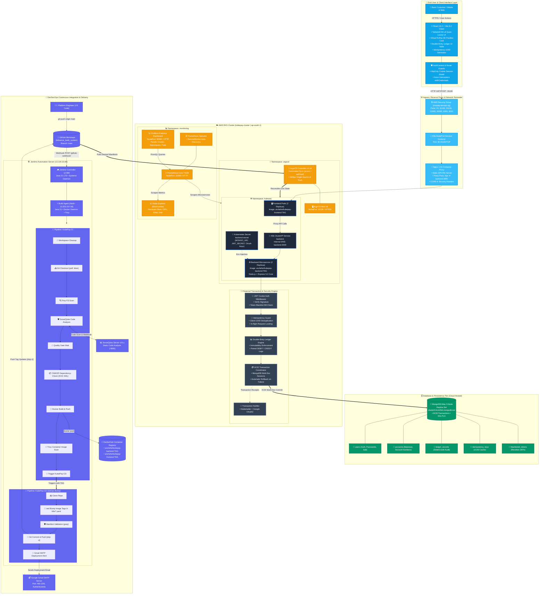

# 🏛️ Kube Pay — Master Full-Stack & DevSecOps Architecture Blueprint
> **Enterprise Architecture Specification (v2.0)**  
> **Author:** Arpit Prajapati  
> **Target Platform:** AWS Elastic Kubernetes Service (EKS) • Hybrid Cloud

---

## 🌟 High-Level Architectural Topology

The following comprehensive architecture diagram illustrates the end-to-end journey of **Kube Pay**: from client interactions, financial transaction engine, and atomic database persistence to automated multi-stage DevSecOps pipelines, GitOps continuous deployment, and real-time cluster observability.

---

## 🔬 Tier-by-Tier Component Deep Dive

### 1. 📱 Client Interface Layer (React 19 + TailwindCSS v4)
- **Framework**: React 19.2 mounted with Vite 8.2 HMR bundler.
- **Aesthetic Identity**: Quiet Luxury Dark Theme (`#0A0C10`), radial lighting, and hairline borders (`rgba(255,255,255,0.08)`).
- **Core Interactive Features**:
  - `TiltCard.jsx`: Mathematical spring physics mapping mouse coordinates to 3D perspective transforms (`rotateX`, `rotateY`).
  - `TransferModal.jsx`: Client-side UUID generator (`crypto.randomUUID()`) creating unique transaction idempotency keys.
  - `TransactionLedger.jsx`: Real-time filterable audit trail mapping paired `DEBIT` and `CREDIT` records.
  - `AuthContext.jsx`: Zero-storage JWT architecture relying on secure HttpOnly cookies and credentials forwarding (`withCredentials: true`).

---

### 2. 🛡️ Financial Core & Banking Engine (Node.js + Express 5)
- **ACID Transaction Engine**: All balance modifications leverage native MongoDB replica set transactions (`session.withTransaction()`). A fund transfer deducts from the sender, credits the receiver, and writes double-entry records in a single atomic commit. Any network or DB failure immediately triggers an automatic rollback.
- **Idempotency Guard**: Prior to executing fund transfers, the engine checks `idempotency_keys`. If a duplicate key is detected within a 24-hour window, the cached transaction result is returned instantly without executing duplicate balance debits.
- **JWT Cookie Auth Shield**: JWT access tokens are signed using cryptographic secrets and delivered via `HttpOnly`, `SameSite: Lax` cookies. A persistent `blacklisted_tokens` collection validates session revocation on user logout.

---

### 3. ☁️ Cloud Infrastructure & Kubernetes Layer (AWS EKS)
- **EKS Cluster**: Managed Kubernetes `v1.32.13` control plane with OIDC-enabled IAM integration.
- **Compute Nodegroup**: Multi-AZ `t3.large` instances running Amazon Linux 2023 and `containerd` container runtime.
- **Namespace Architecture**:
  - `kubepay`: Isolated workload namespace housing frontend replicas, backend microservices, ClusterIP services, and secrets.
  - `argocd`: GitOps continuous delivery controllers and API servers.
  - `monitoring`: Full Prometheus operator, Alertmanager, Node Exporters, and Grafana.

---

### 4. 🚀 DevSecOps Continuous Integration (Jenkins CI)
- **Controller-Worker Topology**:
  - **Master (`13.126.10.89`)**: Lightweight scheduler running on Java 21 LTS with zero build execution overhead.
  - **Worker (`13.203.207.58`)**: Dedicated build agent with unlocked Docker socket and security scanner tooling.
- **Automated Security Gates**:
  - **Trivy**: Static filesystem vulnerability scanner checking dependencies and configurations.
  - **SonarQube**: Static code quality analysis verifying maintainability, test coverage, and security hotspots.
  - **OWASP Dependency-Check**: Vulnerability analysis powered by an authenticated NIST NVD API key, leveraging a persistent 292MB local database cache (`odc.mv.db`) for sub-3-second incremental scans.
  - **Trivy Container Scan**: Pre-deployment inspection of generated Docker image layers.

---

### 5. 🐙 Declarative GitOps Continuous Delivery (ArgoCD)
- **The Self-Healing Loop**: ArgoCD tracks the `k8s/` folder on GitHub `origin/main`. Any divergence between the desired state in Git and the actual state in the EKS cluster is reconciled automatically.
- **Infinite Loop Defense**:
  - Jenkins CD commits with `[skip ci]`.
  - Jenkins SCM configuration enforces `MessageExclusion: (?s).*\[skip ci\].*` and `PathRestriction: k8s/.*`.
  - In-pipeline checkouts explicitly declare `changelog: false, poll: false`, preventing secondary SCM webhook feedback triggers.

---

### 6. 📊 Full-Stack Observability & Metrics (Prometheus & Grafana)
- **Prometheus Operator**: Custom Resource Definitions (`ServiceMonitor`) discovering cluster metrics dynamically.
- **Node Exporter**: DaemonSet on each physical EC2 host capturing host-level CPU, RAM, disk I/O, and networking.
- **Grafana Live Dashboards**: NodePort `32000` analytics visualizing real-time pod health, request throughput, and resource limits.

---

## 🌐 Production Network & Port Topology

| Layer / Component | Host / Target | Port | Protocol | Purpose |
| :--- | :--- | :--- | :--- | :--- |
| **Banking Application UI** | EKS Worker Nodes | `31100` | HTTP (NodePort) | Customer Facing Banking Web App |
| **ArgoCD Dashboard** | EKS Worker Nodes | `31136` | HTTPS (NodePort) | GitOps Release Reconciliation Console |
| **Grafana Analytics** | EKS Worker Nodes | `32000` | HTTP (NodePort) | Real-time Metrics Visualization |
| **Prometheus Core** | EKS Worker Nodes | `30090` | HTTP (NodePort) | Raw PromQL Query Engine & Targets |
| **Jenkins Automation** | Controller EC2 | `8080` | HTTP | CI/CD Pipeline Orchestrator |
| **SonarQube Server** | Controller EC2 | `9000` | HTTP | Code Quality & Security Inspection |
| **MongoDB Atlas** | AWS Managed VPC | `27017` | MongoDB+SRV | ACID Multi-Document Replica Set |
| **Gmail SMTP** | Google Cloud | `465` | SMTPS (SSL) | Automated Deployment & Security Emails |
