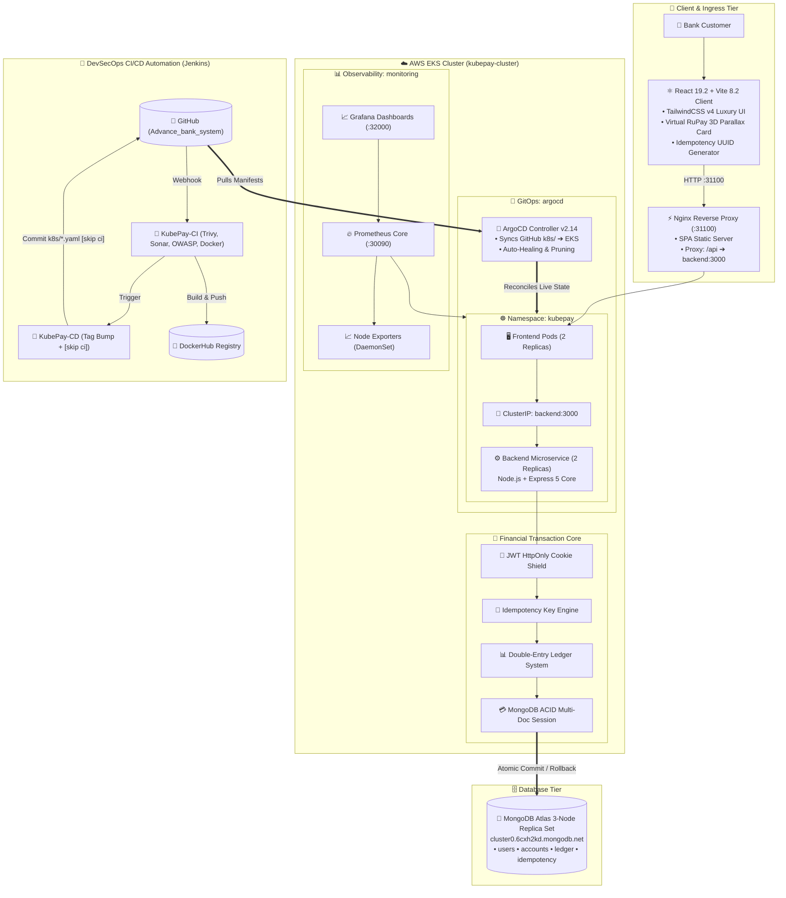

<h1 align="center">✦ Kube Pay — Advanced Banking System</h1>

<p align="center">
  <b>Enterprise-Grade Banking Platform & Financial Transaction System</b><br/>
  <i>Atomic Ledger Operations • Idempotency Engine • JWT Cookie Shield • Modern Luxury UI • DevOps & Cloud Native</i>
</p>

<p align="center">
  
  
  
  
  
  
  
  
  
</p>

---

## 📌 Executive Overview

**Kube Pay** (Advanced Banking System) is a production-grade, full-stack financial application engineered for ultra-high consistency, bank-level security, quiet luxury dark aesthetics, and enterprise DevOps automation. 

Unlike conventional CRUD applications, **Kube Pay** is architected around core **Distributed Systems & Financial Engineering** principles:
- 💳 **Atomic DB Transactions**: Multi-document MongoDB ACID sessions guarantee that funds are never lost or partially transferred.
- 📊 **Double-Entry Ledger Architecture**: Every transfer generates paired `DEBIT` and `CREDIT` records ensuring zero net-loss auditability.
- 🔁 **Idempotent API Engine**: Guaranteed single execution via UUID idempotency keys to eliminate duplicate debits from network retries or double-clicks.
- 🔒 **HttpOnly Cookie Auth Shield**: JWT authentication powered by automatic cookie persistence and server-side token blacklisting.
- ✨ **Quiet Luxury Design System**: React 19 + TailwindCSS v4 frontend featuring glassmorphism cards, dynamic 3D tilt interaction, and zero-latency UI responsiveness.
- 🚢 **DevOps & Cloud-Native Ready**: Fully containerized with multi-stage Docker builds, Nginx reverse proxy, Jenkins CI/CD pipeline (with SonarQube, OWASP & Trivy scans), and AWS EC2 provisioning with Terraform.

---

## 🛠️ Full-Stack Technology Stack

| Domain | Technology | Key Capabilities |
| :--- | :--- | :--- |
| **Client Core** | **React 19.2 + Vite 8.2** | Ultra-fast HMR, optimized component tree, modular clean architecture |
| **Styling & UI** | **Tailwind CSS v4 + Custom Glassmorphism** | Custom dark theme (`#0A0C10`), glass cards, radial glares, 3D tilt effects |
| **Icons & Motion** | **Lucide Icons + Custom CSS Keyframes** | Modern minimalist iconography, floating 3D cards, smooth spring transitions |
| **State & Router** | **React Router v7 + Context API** | `AuthContext` persistent session management & `PrivateRoute` route guards |
| **HTTP Client** | **Axios 1.19** | Centralized interceptors, automated error mapping & CORS `withCredentials` support |
| **Server Engine** | **Node.js + Express 5.2** | RESTful services, strict input validation, cookie parsers, CORS credentials |
| **Database** | **MongoDB + Mongoose 9.8** | Atomic Session Transactions (ACID), Schema Validation, Ledger models |
| **Security** | **JWT + Bcrypt.js + Token Blacklist** | Cryptographic hashing, HTTP-Only secure cookies, blacklisted token tracking |
| **DevOps & CI/CD** | **Docker + Jenkins + SonarQube + Trivy** | Automated security scanning, quality gates, multi-container Docker Compose |
| **Infrastructure** | **Terraform (AWS)** | Automated AWS EC2 infrastructure provisioning as code |

---

## 🏛️ Master System Architecture & Engineering Blueprint

> 📖 **Full Architectural Specification**: See [ARCHITECTURE.md](ARCHITECTURE.md) for the complete multi-tier architectural blueprint.



---

### 1. 🔄 Atomic Money Transfers (ACID Sessions)
When User A sends money to User B:
```
Client Request (fromAccount, toAccount, amount, idempotencyKey)
   │
   ├──▶ 1. Begin MongoDB Session Transaction
   ├──▶ 2. Validate Sender Balance >= Amount
   ├──▶ 3. Deduct Amount from Sender Account
   ├──▶ 4. Add Amount to Receiver Account
   ├──▶ 5. Create DEBIT Ledger Record for Sender
   ├──▶ 6. Create CREDIT Ledger Record for Receiver
   ├──▶ 7. Commit Session Transaction
   └──▶ Response 200 OK (Atomic Success)
   
* In case of any error at any step, the transaction immediately ABORTS and ROLLS BACK.
```

### 2. 📊 Double-Entry Ledger System
Money is never updated arbitrarily. Balance calculations are strictly bound to audit logs:
- **DEBIT Entry**: Applied to `fromAccount` with negative value impact.
- **CREDIT Entry**: Applied to `toAccount` with positive value impact.

### 3. 🔁 Idempotency Key Engine
To protect against network delays, button double-clicks, or automated retries:
```
Incoming API Request ──▶ Check `idempotencyKey` in Transactions Collection
                             │
            ┌────────────────┴────────────────┐
            ▼                                 ▼
   [Key Exists in DB]                [Key is New]
   Return cached transaction          Execute atomic transfer
   result immediately                 & store idempotency key
```

---

## 📁 Repository Structure

```
adv_bank_system/
├── frontend/                     # Client Web Application (React 19 + Vite)
│   ├── public/                   # Static assets & favicon
│   ├── src/
│   │   ├── assets/               # Branding assets
│   │   ├── components/           # Reusable UI Components
│   │   │   ├── Button.jsx        # Production-grade button primitive
│   │   │   ├── Input.jsx         # Controlled form input helper
│   │   │   ├── Navbar.jsx        # Sticky glassmorphic navbar
│   │   │   └── TiltCard.jsx      # 3D parallax mouse-tilt card primitive
│   │   ├── context/
│   │   │   └── AuthContext.jsx   # Global user state & session persistence
│   │   ├── pages/
│   │   │   ├── LandingPage.jsx   # Luxury landing page with 3D interactive preview
│   │   │   ├── LoginPage.jsx     # Glassmorphic login authentication
│   │   │   ├── RegisterPage.jsx  # Glassmorphic registration form
│   │   │   └── DashboardPage.jsx # Full-featured banking dashboard
│   │   ├── routes/
│   │   │   └── PrivateRoute.jsx  # Protected route guard
│   │   ├── services/
│   │   │   ├── api.js            # Axios client with interceptors & base config
│   │   │   ├── auth.service.js   # Auth API handlers (Login, Register, Logout)
│   │   │   ├── account.service.js# Bank account CRUD endpoints
│   │   │   └── transaction.service.js # Money transfer endpoints
│   │   ├── App.jsx               # React Router configuration
│   │   ├── index.css             # Tailwind v4 directives, custom styles & 3D keyframes
│   │   └── main.jsx              # React DOM root entry
│   ├── Dockerfile                # Multi-stage frontend Docker build with Nginx
│   ├── nginx.conf                # Nginx reverse proxy configuration
│   ├── package.json              # Frontend dependencies & scripts
│   └── vite.config.js            # Vite proxy & Tailwind plugin setup
│
├── src/                          # Express REST API Backend
│   ├── controllers/              # Auth, Account & Transaction controllers
│   ├── db/                       # MongoDB database connection
│   ├── middleware/               # Auth middleware & token verification
│   ├── models/                   # User, Account, Transaction & Blacklist schemas
│   ├── routes/                   # Auth, Account & Transaction express routers
│   ├── services/                 # Email service (OAuth2) & helper utilities
│   └── app.js                    # Express app configuration & CORS setup
│
├── terraform/                    # Infrastructure as Code (AWS EC2)
│   ├── ec2.tf                    # EC2 instance & security groups
│   ├── terraform.tf              # AWS provider configuration
│   └── variables.tf              # Configurable deployment variables
│
├── docker-compose.yml            # Multi-container orchestration (Backend + Frontend)
├── Dockerfile                    # Node.js backend Docker container
├── jenkins                       # Jenkins declarative CI/CD pipeline
├── server.js                     # Backend HTTP server entry
├── package.json                  # Root dependencies & scripts
└── README.md                     # Master documentation
```

---

## 📡 API Reference

### 🔐 Auth Endpoints (`/api/auth`)
| Method | Endpoint | Description | Auth Required |
| :--- | :--- | :--- | :---: |
| `POST` | `/api/auth/register` | Register new user account (`email`, `password`, `name`) | ❌ |
| `POST` | `/api/auth/login` | Authenticate user & set JWT HttpOnly cookie | ❌ |
| `POST` | `/api/auth/logout` | Revoke token, add to blacklist & clear cookie | ✅ |

### 💳 Account Endpoints (`/api/account`)
| Method | Endpoint | Description | Auth Required |
| :--- | :--- | :--- | :---: |
| `POST` | `/api/account/` | Create a new bank account for logged-in user | ✅ |
| `GET` | `/api/account/` | List all active bank accounts belonging to user | ✅ |
| `GET` | `/api/account/balance/:accountId` | Get real-time ledger balance for account | ✅ |

### 💸 Transaction Endpoints (`/api/transaction`)
| Method | Endpoint | Description | Auth Required |
| :--- | :--- | :--- | :---: |
| `POST` | `/api/transaction/` | Execute atomic fund transfer between accounts | ✅ |
| `GET` | `/api/transaction/my-transactions` | Fetch full ledger transaction history | ✅ |
| `POST` | `/api/transaction/system/initial-funds` | Deposit initial test balance into account | ✅ |

---

## ⚡ Quick Start Guide

### Prerequisites
- Node.js `v18.0.0` or higher
- MongoDB instance (Local or MongoDB Atlas)
- Docker & Docker Compose (Optional for containerized run)

### Option 1: Running Locally (Development Mode)

#### 1. Backend Setup
```bash
# Navigate to project root
cd adv_bank_system

# Install dependencies
npm install

# Configure environment variables (.env)
# Create a .env file with:
PORT=3000
MONGO_URI="mongodb+srv://<username>:<password>@cluster.mongodb.net/bank-system"
JWT_SECRET="your_jwt_secret_key"
EMAIL_USER="your_email@gmail.com"
CLIENT_ID="your_google_client_id"
CLIENT_SECRET="your_google_client_secret"
REFRESH_TOKEN="your_google_refresh_token"

# Start development server
npm run dev
```

#### 2. Frontend Setup
```bash
# Open a new terminal and navigate to frontend
cd adv_bank_system/frontend

# Install dependencies
npm install

# Configure frontend environment (.env)
VITE_API_URL=http://localhost:3000/api

# Start Vite dev server
npm run dev
```
Open **`http://localhost:8000`** (or port specified in terminal) in your browser.

---

### Option 2: Running with Docker Compose

Run the entire application stack (Frontend + Backend + Reverse Proxy) with a single command:

```bash
# Build and run all containers
docker-compose up --build -d

# Check running containers
docker-compose ps

# Stop containers
docker-compose down
```
- **Frontend App**: `http://localhost:5173`
- **Backend API**: `http://localhost:3001`

---

## 🚀 Enterprise DevSecOps & GitOps Architecture

The application is deployed on **AWS EKS** following production-grade **DevSecOps & GitOps** standards:

```text
┌─────────────────┐      Webhook      ┌─────────────────────────┐      Triggers      ┌─────────────────────────┐
│  Developer Git  │──────────────────▶│  Jenkins CI Pipeline   │───────────────────▶│  Jenkins CD Pipeline   │
│  (origin/main)  │                   │ (Sonar, OWASP, Trivy)   │                    │ (GitOps Version Bump)   │
└─────────────────┘                   └───────────┬─────────────┘                    └────────────┬────────────┘
                                                  │                                               │
                                           Pushes │                                        Pushes │ [skip ci]
                                                  ▼                                               ▼
                                      ┌───────────────────────┐                      ┌─────────────────────────┐
                                      │   DockerHub Registry  │                      │    GitOps Manifests     │
                                      │ (backend:TAG, front)  │                      │  (k8s/*.yaml on GitHub) │
                                      └───────────────────────┘                      └────────────┬────────────┘
                                                                                                  │
                                              ┌───────────────────────────────────────────────────┘
                                              ▼ Pulls Desired State
                                      ┌───────────────────────┐
                                      │  ArgoCD Reconciliation│
                                      │   (Synced & Healthy)  │
                                      └───────────┬───────────┘
                                                  │
                                                  ▼ Synchronizes Live Pods
                                      ┌───────────────────────┐                      ┌─────────────────────────┐
                                      │    AWS EKS Cluster    │◀─────────────────────│  Prometheus & Grafana   │
                                      │  (kubepay namespace)  │  Scrapes Live Stats  │ (Observability Stack)   │
                                      └───────────────────────┘                      └─────────────────────────┘
```

### 1. 🔍 Automated Continuous Integration (`KubePay-CI`)
- **Node-Isolated Build Agent**: Master delegates all build workloads to an Ubuntu 22.04 SSH agent (`Node`).
- **Security Scanners**:
  - **Trivy FS**: Scans source directories for vulnerabilities before compiling.
  - **SonarQube Static Analysis**: Enforces clean code quality gates (`waitForQualityGate`).
  - **OWASP Dependency-Check**: Scans third-party NPM dependencies against the official NIST NVD database cached locally via API key.
- **Image Artifacts**: Builds multi-stage Docker images (`aruhehe/kubepay-backend`, `aruhehe/kubepay-frontend`) tagged with `BUILD_NUMBER` and pushes to DockerHub.
- **Trivy Image Scan**: Scans generated container images for OS-level CVEs before deployment.

### 2. ⚡ Declarative GitOps CD (`KubePay-CD` + ArgoCD)
- **Automated Version Bumping**: Downstream CD job parses image tags, updates `k8s/*.yaml` deployment manifests via `sed`, and commits with `[skip ci]`.
- **Infinite Loop Defense**: Configured Git SCM exclusions (`(?s).*\[skip ci\].*` and `k8s/.*`) with non-polling pipeline checkouts to prevent webhook feedback loops.
- **ArgoCD Reconciliation**: In-cluster ArgoCD controller detects manifest updates on GitHub and performs rolling updates across EKS pods with zero downtime.

### 3. 📊 Full-Stack Observability (Prometheus & Grafana)
- **Prometheus Operator**: Automatically discovers and scrapes Kubernetes API metrics, node hardware counters, and application pods.
- **Node Exporter DaemonSets**: Real-time CPU, RAM, disk, and network monitoring across all physical EC2 cluster nodes.
- **Grafana Live Dashboards**: Visual performance dashboards filtered by the `kubepay` namespace.

---

## 🌐 Live Production Endpoints

| Service | Access URL | Port / Protocol | Credentials / Notes |
| :--- | :--- | :--- | :--- |
| **Kube Pay Banking App** | `http://13.232.59.33:31100` | NodePort `31100` / HTTP | Full-Stack UI (Register, Login, Transfers) |
| **Jenkins Controller** | `http://13.126.10.89:8080` | Port `8080` / HTTP | CI/CD Automation (`KubePay-CI`, `KubePay-CD`) |
| **SonarQube Server** | `http://13.126.10.89:9000` | Port `9000` / HTTP | Static Code Analysis & Quality Gates |
| **ArgoCD Dashboard** | `https://13.232.59.33:31136` | NodePort `31136` / HTTPS | User: `admin` (Syncs GitHub `k8s/` to EKS) |
| **Grafana Dashboard** | `http://13.232.59.33:32000` | NodePort `32000` / HTTP | User: `admin`, Password in Kubernetes Secret |
| **Prometheus Server** | `http://13.232.59.33:30090` | NodePort `30090` / HTTP | Raw PromQL Metrics & Target Status |
| **Alternative EKS Node** | `http://13.127.50.2:31100` | NodePort `31100` / HTTP | Redundant node endpoint for banking app |


---

## 🛡️ Security & Resilience Features

- ✅ **ACID Transactions**: MongoDB session-based transfers preventing partial debits or balance inconsistencies.
- ✅ **Idempotency Guarantee**: Unique transaction tokens preventing double debits from repeated requests.
- ✅ **HttpOnly Cookies**: Prevents client-side XSS attacks from reading access tokens.
- ✅ **Token Blacklisting**: Revoked JWT tokens stored on logout to prevent reuse.
- ✅ **Password Hashing**: Secure salted hashes via `bcryptjs`.
- ✅ **CORS & Proxy Security**: Whitelisted origin matching with credential forwarding.
- ✅ **Input Validation**: Sanitized schema models rejecting invalid inputs.

---

## 🗺️ Feature Status

| Feature / Module | Status |
| :--- | :---: |
| Backend Express REST API & Mongoose ACID Sessions | 🟢 Completed |
| Double-Entry Ledger System & Idempotency Engine | 🟢 Completed |
| JWT Authentication & HttpOnly Cookie Management | 🟢 Completed |
| Token Blacklist & Session Revocation | 🟢 Completed |
| Quiet Luxury Dark Theme Design System (`#0A0C10`) | 🟢 Completed |
| 3D Interactive Parallax Tilt Card Component (`TiltCard.jsx`) | 🟢 Completed |
| Landing Page with Interactive 3D Device & Card Mockup | 🟢 Completed |
| Glassmorphic Login & Register Pages with Live Feedback | 🟢 Completed |
| Interactive Dashboard with Net Worth & Account Switcher | 🟢 Completed |
| Atomic Fund Transfer Modal with Idempotency Key Generation | 🟢 Completed |
| Live Filterable Transaction History Ledger | 🟢 Completed |
| Realistic Virtual Platinum RuPay Debit Card Interface | 🟢 Completed |
| Multi-Stage Docker Containerization & Nginx Reverse Proxy | 🟢 Completed |
| Jenkins Declarative CI/CD Pipeline (SonarQube + Trivy + OWASP) | 🟢 Completed |
| Terraform AWS Infrastructure Automation | 🟢 Completed |

---

<p align="center">
  <b>Crafted with ❤️ by Arpit Prajapati</b><br/>
  🚀 <i>Built for Real-World Financial Systems Engineering & Cloud-Native Scale</i>
</p>
