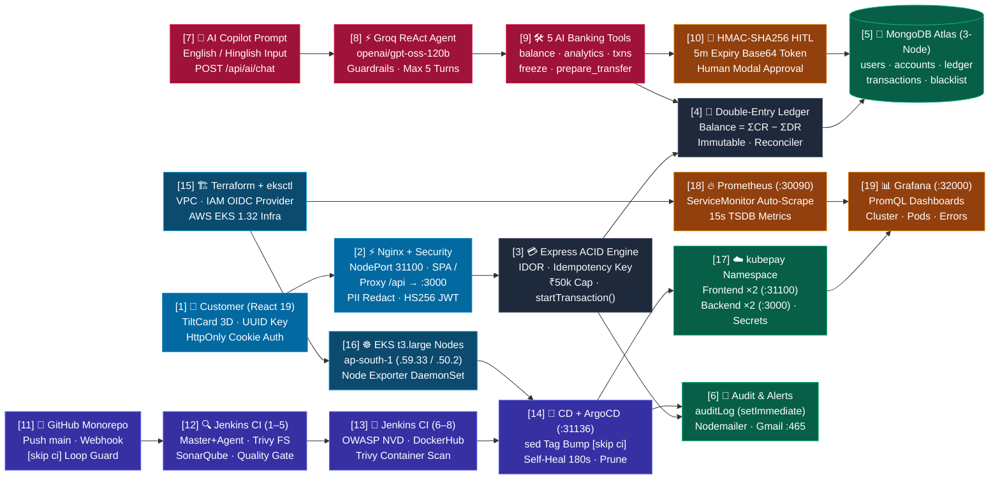

### KubePay — Master Full-Stack, DevSecOps & AI Architecture

```mermaid
%%{init: {'flowchart': {'nodeSpacing': 24, 'rankSpacing': 34, 'padding': 10}}}%%
graph LR

  C1["[1] 👤 Customer (React 19)<br/>TiltCard 3D · UUID Key<br/>HttpOnly Cookie Auth"]
  A1["[7] 💬 AI Copilot Prompt<br/>English / Hinglish Input<br/>POST /api/ai/chat"]
  D1["[11] 🐙 GitHub Monorepo<br/>Push main · Webhook<br/>[skip ci] Loop Guard"]
  I1["[15] 🏗️ Terraform + eksctl<br/>VPC · IAM OIDC Provider<br/>AWS EKS 1.32 Infra"]

  C2["[2] ⚡ Nginx + Security<br/>NodePort 31100 · SPA /<br/>Proxy /api → :3000<br/>PII Redact · HS256 JWT"]
  A2["[8] ⚡ Groq ReAct Agent<br/>openai/gpt-oss-120b<br/>Guardrails · Max 5 Turns"]
  D2["[12] 🔍 Jenkins CI (1–5)<br/>Master+Agent · Trivy FS<br/>SonarQube · Quality Gate"]
  I2["[16] ☸️ EKS t3.large Nodes<br/>ap-south-1 (.59.33 / .50.2)<br/>Node Exporter DaemonSet"]

  C3["[3] 💳 Express ACID Engine<br/>IDOR · Idempotency Key<br/>₹50k Cap · startTransaction()"]
  A3["[9] 🛠️ 5 AI Banking Tools<br/>balance · analytics · txns<br/>freeze · prepare_transfer"]
  D3["[13] 🐳 Jenkins CI (6–8)<br/>OWASP NVD · DockerHub<br/>Trivy Container Scan"]
  O3["[18] 🔥 Prometheus (:30090)<br/>ServiceMonitor Auto-Scrape<br/>15s TSDB Metrics"]

  L4["[4] 📒 Double-Entry Ledger<br/>Balance = ΣCR − ΣDR<br/>Immutable · Reconciler"]
  H4["[10] 🔐 HMAC-SHA256 HITL<br/>5m Expiry Base64 Token<br/>Human Modal Approval"]
  D4["[14] 🔄 CD + ArgoCD (:31136)<br/>sed Tag Bump [skip ci]<br/>Self-Heal 180s · Prune"]
  E4["[17] ☁️ kubepay Namespace<br/>Frontend ×2 (:31100)<br/>Backend ×2 (:3000) · Secrets"]

  DB1[("[5] 🍃 MongoDB Atlas (3-Node)<br/>users · accounts · ledger<br/>transactions · blacklist")]
  DB2["[6] 📧 Audit & Alerts<br/>auditLog (setImmediate)<br/>Nodemailer · Gmail :465"]
  O4["[19] 📊 Grafana (:32000)<br/>PromQL Dashboards<br/>Cluster · Pods · Errors"]

  C1 --> C2 --> C3 --> L4 --> DB1
  A1 --> A2 --> A3 --> H4 --> DB1
  C3 --> DB2
  A3 --> L4
  D1 --> D2 --> D3 --> D4 --> E4 --> O4
  I1 --> I2 --> D4
  I1 --> O3 --> O4
  D4 --> DB2

  classDef bank fill:#0369a1,stroke:#0284c7,color:#fff
  classDef engine fill:#1e293b,stroke:#475569,color:#f8fafc
  classDef ai fill:#9f1239,stroke:#e11d48,color:#fff
  classDef hitl fill:#92400e,stroke:#d97706,color:#fff
  classDef db fill:#065f46,stroke:#10b981,color:#fff
  classDef ops fill:#3730a3,stroke:#6366f1,color:#fff
  classDef eks fill:#0c4a6e,stroke:#0ea5e9,color:#fff

  class C1,C2 bank
  class C3,L4 engine
  class A1,A2,A3 ai
  class H4,O3,O4 hitl
  class DB1,E4,DB2 db
  class D1,D2,D3,D4 ops
  class I1,I2 eks
```
