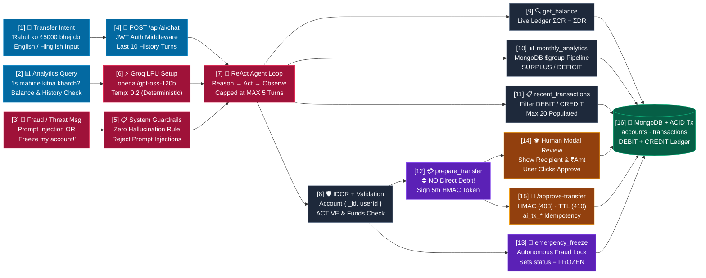

### KubePay — AI Financial Copilot & Cryptographic HITL Architecture

```mermaid
%%{init: {'flowchart': {'nodeSpacing': 24, 'rankSpacing': 34, 'padding': 10}}}%%
graph LR

  U1["[1] 👤 Transfer Intent<br/>'Rahul ko ₹5000 bhej do'<br/>English / Hinglish Input"]
  U2["[2] 📊 Analytics Query<br/>'Is mahine kitna kharch?'<br/>Balance & History Check"]
  U3["[3] 🚨 Fraud / Threat Msg<br/>Prompt Injection OR<br/>'Freeze my account!'"]

  A2["[4] 📨 POST /api/ai/chat<br/>JWT Auth Middleware<br/>Last 10 History Turns"]
  G2["[6] ⚡ Groq LPU Setup<br/>openai/gpt-oss-120b<br/>Temp: 0.2 (Deterministic)"]
  S2["[5] 📋 System Guardrails<br/>Zero Hallucination Rule<br/>Reject Prompt Injections"]

  R3["[7] 🔄 ReAct Agent Loop<br/>Reason → Act → Observe<br/>Capped at MAX 5 Turns"]
  ID3["[8] 🛡️ IDOR + Validation<br/>Account { _id, userId }<br/>ACTIVE & Funds Check"]

  T4a["[9] 🔍 get_balance<br/>Live Ledger ΣCR − ΣDR"]
  T4b["[10] 📊 monthly_analytics<br/>MongoDB $group Pipeline<br/>SURPLUS / DEFICIT"]
  T4c["[11] 📋 recent_transactions<br/>Filter DEBIT / CREDIT<br/>Max 20 Populated"]
  T4d["[12] 💳 prepare_transfer<br/>⛔ NO Direct Debit!<br/>Sign 5m HMAC Token"]
  T4e["[13] 🚨 emergency_freeze<br/>Autonomous Fraud Lock<br/>Sets status = FROZEN"]

  H5a["[14] 👁️ Human Modal Review<br/>Show Recipient & ₹Amt<br/>User Clicks Approve"]
  H5b["[15] 🔐 /approve-transfer<br/>HMAC (403) · TTL (410)<br/>ai_tx_* Idempotency"]
  DB5[("[16] 🍃 MongoDB + ACID Tx<br/>accounts · transactions<br/>DEBIT + CREDIT Ledger")]

  U1 --> A2 --> R3
  U2 --> G2 --> R3
  U3 --> S2 --> R3
  R3 --> ID3
  R3 --> T4a --> DB5
  R3 --> T4b --> DB5
  R3 --> T4c --> DB5
  ID3 --> T4d --> H5a --> DB5
  T4d --> H5b --> DB5
  ID3 --> T4e --> DB5

  classDef usr fill:#0369a1,stroke:#0284c7,color:#fff
  classDef ai fill:#9f1239,stroke:#e11d48,color:#fff
  classDef tool fill:#1e293b,stroke:#64748b,color:#f8fafc
  classDef act fill:#5b21b6,stroke:#7c3aed,color:#fff
  classDef hitl fill:#92400e,stroke:#f59e0b,color:#fff
  classDef db fill:#065f46,stroke:#10b981,color:#fff

  class U1,U2,A2 usr
  class U3,S2,G2,R3 ai
  class ID3,T4a,T4b,T4c tool
  class T4d,T4e act
  class H5a,H5b hitl
  class DB5 db
```
