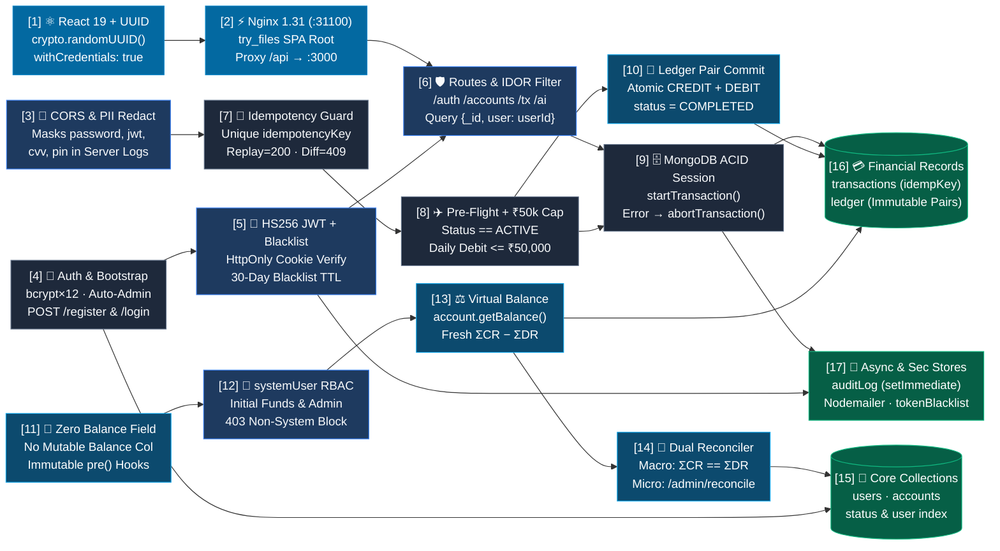

### KubePay — Backend Core Banking & ACID Ledger Architecture

```mermaid
%%{init: {'flowchart': {'nodeSpacing': 24, 'rankSpacing': 34, 'padding': 10}}}%%
graph LR

  R1["[1] ⚛️ React 19 + UUID<br/>crypto.randomUUID()<br/>withCredentials: true"]
  A1["[4] 🔑 Auth & Bootstrap<br/>bcrypt×12 · Auto-Admin<br/>POST /register & /login"]
  G1["[3] 🧹 CORS & PII Redact<br/>Masks password, jwt,<br/>cvv, pin in Server Logs"]
  L1["[11] 📒 Zero Balance Field<br/>No Mutable Balance Col<br/>Immutable pre() Hooks"]

  R2["[2] ⚡ Nginx 1.31 (:31100)<br/>try_files SPA Root<br/>Proxy /api → :3000"]
  A2["[5] 🔐 HS256 JWT + Blacklist<br/>HttpOnly Cookie Verify<br/>30-Day Blacklist TTL"]
  G2["[7] 🔁 Idempotency Guard<br/>Unique idempotencyKey<br/>Replay=200 · Diff=409"]
  L2["[12] 👑 systemUser RBAC<br/>Initial Funds & Admin<br/>403 Non-System Block"]

  R3["[6] 🛡️ Routes & IDOR Filter<br/>/auth /accounts /tx /ai<br/>Query {_id, user: userId}"]
  P3["[8] ✈️ Pre-Flight + ₹50k Cap<br/>Status == ACTIVE<br/>Daily Debit <= ₹50,000"]
  L3["[13] ⚖️ Virtual Balance<br/>account.getBalance()<br/>Fresh ΣCR − ΣDR"]

  E4["[9] 🗄️ MongoDB ACID Session<br/>startTransaction()<br/>Error → abortTransaction()"]
  L4["[10] 📒 Ledger Pair Commit<br/>Atomic CREDIT + DEBIT<br/>status = COMPLETED"]
  RC4["[14] 🔄 Dual Reconciler<br/>Macro: ΣCR == ΣDR<br/>Micro: /admin/reconcile"]

  DB1[("[15] 🍃 Core Collections<br/>users · accounts<br/>status & user index")]
  DB2[("[16] 💳 Financial Records<br/>transactions (idempKey)<br/>ledger (Immutable Pairs)")]
  DB3["[17] 📧 Async & Sec Stores<br/>auditLog (setImmediate)<br/>Nodemailer · tokenBlacklist"]

  R1 --> R2 --> R3 --> E4 --> DB2
  A1 --> A2 --> R3
  G1 --> G2 --> P3 --> L4 --> DB2
  L1 --> L2 --> L3 --> RC4 --> DB1
  L3 --> DB2
  P3 --> E4
  E4 --> DB3
  A2 --> DB3
  A1 --> DB1

  classDef edge fill:#0369a1,stroke:#0284c7,color:#fff
  classDef sec fill:#1e3a5f,stroke:#3b82f6,color:#f8fafc
  classDef tx fill:#1e293b,stroke:#64748b,color:#f8fafc
  classDef ledger fill:#0c4a6e,stroke:#0ea5e9,color:#fff
  classDef db fill:#065f46,stroke:#10b981,color:#fff

  class R1,R2 edge
  class G1,A2,R3,L2 sec
  class A1,G2,P3,E4 tx
  class L1,L3,L4,RC4 ledger
  class DB1,DB2,DB3 db
```
