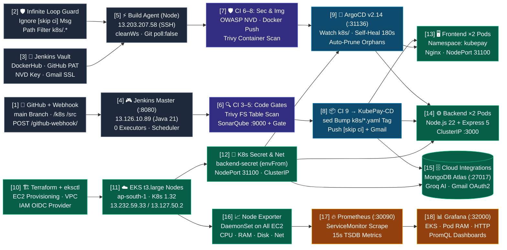

### KubePay — DevSecOps CI/CD, GitOps & AWS EKS Architecture

```mermaid
%%{init: {'flowchart': {'nodeSpacing': 26, 'rankSpacing': 36, 'padding': 10}}}%%
graph LR

  V1["[1] 🐙 GitHub + Webhook<br/>main Branch · /k8s /src<br/>POST /github-webhook/"]
  V2["[2] 🛡️ Infinite Loop Guard<br/>Ignore [skip ci] Msg<br/>Path Filter k8s/.*"]
  S0["[3] 🔐 Jenkins Vault<br/>DockerHub · GitHub PAT<br/>NVD Key · Gmail SSL"]
  I1["[10] 🏗️ Terraform + eksctl<br/>EC2 Provisioning · VPC<br/>IAM OIDC Provider"]

  M2["[4] 🎮 Jenkins Master (:8080)<br/>13.126.10.89 (Java 21)<br/>0 Executors · Scheduler"]
  A2["[5] ⚡ Build Agent (Node)<br/>13.203.207.58 (SSH)<br/>cleanWs · Git poll:false"]
  I2["[11] ☁️ EKS t3.large Nodes<br/>ap-south-1 · K8s 1.32<br/>13.232.59.33 / 13.127.50.2"]
  N2["[16] 📈 Node Exporter<br/>DaemonSet on All EC2<br/>CPU · RAM · Disk · Net"]

  C3a["[6] 🔍 CI 3–5: Code Gates<br/>Trivy FS Table Scan<br/>SonarQube :9000 + Gate"]
  C3b["[7] 🛡️ CI 6–8: Sec & Img<br/>OWASP NVD · Docker Push<br/>Trivy Container Scan"]
  SEC3["[12] 🔑 K8s Secret & Net<br/>backend-secret (envFrom)<br/>NodePort 31100 · ClusterIP"]

  D4["[8] 📦 CI 9 → KubePay-CD<br/>sed Bump k8s/*.yaml Tag<br/>Push [skip ci] + Gmail"]
  AR4["[9] 🔄 ArgoCD v2.14 (:31136)<br/>Watch k8s/ · Self-Heal 180s<br/>Auto-Prune Orphans"]
  PR4["[17] 🔥 Prometheus (:30090)<br/>ServiceMonitor Scrape<br/>15s TSDB Metrics"]

  FE5["[13] 🖥️ Frontend ×2 Pods<br/>Namespace: kubepay<br/>Nginx · NodePort 31100"]
  BE5["[14] ⚙️ Backend ×2 Pods<br/>Node.js 22 + Express 5<br/>ClusterIP :3000"]
  EXT5[("[15] 🗄️ Cloud Integrations<br/>MongoDB Atlas (:27017)<br/>Groq AI · Gmail OAuth2")]
  GR5["[18] 📊 Grafana (:32000)<br/>EKS · Pod RAM · HTTP<br/>PromQL Dashboards"]

  V1 --> M2 --> C3a --> D4 --> FE5
  V2 --> A2 --> C3b --> AR4 --> BE5
  S0 --> A2
  D4 --> BE5
  AR4 --> FE5
  I1 --> I2 --> SEC3 --> AR4
  SEC3 --> BE5
  I2 --> N2 --> PR4 --> GR5
  D4 --> EXT5
  SEC3 --> EXT5

  classDef vcs fill:#1e293b,stroke:#64748b,color:#f8fafc
  classDef ci fill:#312e81,stroke:#6366f1,color:#fff
  classDef cd fill:#0c4a6e,stroke:#0284c7,color:#fff
  classDef eks fill:#065f46,stroke:#10b981,color:#fff
  classDef mon fill:#92400e,stroke:#f59e0b,color:#fff

  class V1,V2,S0,M2,A2 vcs
  class C3a,C3b ci
  class D4,AR4 cd
  class I1,I2,N2,SEC3,FE5,BE5,EXT5 eks
  class PR4,GR5 mon
```
